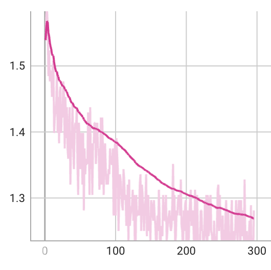

ReGPT
===
**ReGPT:** Using **Re**trieve Technique to **Re**place the Embedding Layer of **GPT**

## Requirements
- Python 3.8+
- 8*A100(40GB) at least

```shell
pip install -r requirements.txt
```

## Data Preparation
The corpus for Wikitext-103, Law-MT, and En-Wiki can be downloaded from [this link](https://pan.baidu.com/s/13JmmAZPN_5jLkSbS-V51rg) (with the code `ufhn`). 
```shell
mkdir ../data_of_ReGPT
```
Then, you can put them into the `../data_of_ReGPT` folder and preprocess them by the following script:
```shell
python src/data_construction/preprocess_dataset.py WikiText-103
python src/data_construction/preprocess_dataset.py Law-MT
python src/data_construction/preprocess_dataset.py En-Wiki 
```


For C4, you can download it from [huggingface](https://huggingface.co/datasets/c4) by the following script:
```python
from datasets import load_dataset

dataset = load_dataset("c4", "en", split="train")
dataset.save_to_disk("../data_of_ReGPT/c4_en")
```


## Training Pipeline
<!-- pipeline: training phrase tokenizer-->
First, we train a phrase tokenizer on the training set of Wikitext-103 with the tokenizer of `meta-llama/Llama-2-7b-hf` as the initialization. 
```shell
python src/data_construction/train_tokenizer.py WikiText-103 meta-llama/Llama-2-7b-hf 1000000
```

Then, the phrase tokenizer is saved in `../data_of_ReGPT/llama2-7b-phrase-tokenizer-trained-on-WikiText103/` and the phrases are saved in `../data_of_ReGPT/phrases_WikiText-103/phrases.npy`.

<!-- pipeline: encoding phrases-->
Subsequently, we need to encoding the phrases using a dense retrieval model.
```shell
python src/data_construction/compute_embedding_by_dense_retrieval.py WikiText-103 facebook/contriever
```
The embedding of phrases is saved in `../data_of_ReGPT/phrases_WikiText-103/phrases_embeddings.npy` and the normalized embedding is saved in `../data_of_ReGPT/phrases_WikiText-103/phrases_embeddings_normalized.npy`.

To accelerate the training process, we also need to build a negative sample pool for each phrase. 
```shell
python src/data_construction/retrieve_negatives.py WikiText-103 1000000 101
```
The negative sample pool is saved in `../data_of_ReGPT/phrases_WikiText-103/negatives.tsv`.

Now, we can train the ReGPT model on the training set of En-Wiki.


The optimization includes two training stages.

In the first stage, we train the ReGPT model with in-batch negatives (random negatives). 
```shell
sh scripts/rellama_run.sh config/rellama_config_stage1.yaml
```

<!-- add picture of loss -->


In the second stage, we train the ReGPT model with hard negatives. 
```shell
sh scripts/rellama_run.sh config/rellama_config_stage2.yaml
```
<!-- add picture of loss -->



### Evaluation
TODO

We can manually evaluate the generation performance of the ReGPT model by the following script:
```shell
python src/regpt_test.py
```


